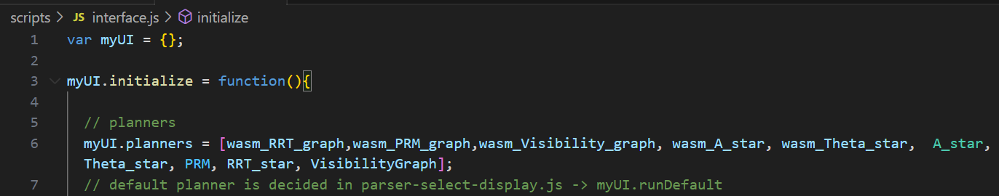

# Path Planner

This project allows you to visualize and compare pathfinding algorithms.

Currently supported languages include:
- Javascript (JS)
- C++

## How to Use 

Download or clone the repository to your local machine.

Then, choose one of the languages below.

- [Javascript](#inclusion-of-js-files)
- [C++/Wasm](#c++)

### Inclusion of JS files
This website runs entirely on client-side JS, so there are no environments or complicated file structures.

All JS files are to be referenced inside the `<script></script>` section of [index.html](index.html).

### Creation of Planners
All planners are located in [scripts/pathfinding](scripts/pathfinding/). 

Grid-based planners inherit from the `GridPathfinder` class 

Other planners inherit from the `Pathfinder` class.

#### Properties and Methods
Each planner needs to have the following properties:

static getter methods:
```
- display_name() -> String
- indexOfCollapsiblesToExpand() -> Array[Int]
- pseudoCode() -> Object{code: String, ref: String}
- hoverData() -> Array[Object{id: String, display_name: String, type: String, canvasId: String}]
- infoTables() -> Array[Object{if: String, displayName: String, headers: Array[String]}]
```

getter methods:
```
- canvases() -> Array[Object{id: String, drawType: String, drawOrder: Int, fixedResVal: Int, valType: String, defaultVal: Number, colors: Array[String], toggle: String, checked: bool, bigMap: bool, minVal: Number(nullable), maxVal: Number(nullable), lineWidth: 1}]
```

methods:
```
constructor() -> undefined
setConfig(uid, value) -> undefined
search(start, goal) -> undefined
_run_next_search(planner, batch_size) -> undefined
```
As searching can take a non-negligible amount of time, we use the `setTimeout` function to make non-blocking calls and the `Promise` to wait for the search to finish

This is a rough overview of the implementation:
```js
class Planner{
  search(...){
    // initialises variables and search configs
    let planner = this;
    return new Promise((resolve, reject) => {
      setTimeout(planner._run_next_search(planner), 0);
    });
  }

  _run_next_search(planner){
    // continues algorithm
    if(found) return this._terminate_search();
    // else if not found in this iteration
    return new Promise((resolve, reject) => {
      setTimeout(planner._run_next_search(planner), 0);
    });
  }
}

// to call the search
myPlanner.search(...).then(_=>{
  // do things after searching
})
```

### Inclusion of Planners
After creating a planner js file and linking it in [index.html](index.html), add the new planner class to the list of planners in [interface.js](interface.js).



That's it! 


### C++