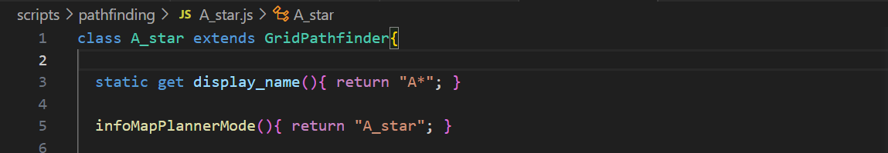
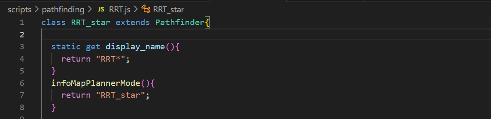

# Path Planner

This project allows you to visualize and compare pathfinding algorithms.

Currently supported languages include:
- Javascript (JS)
- C++

## How it Works
### Inclusion of JS files
This website runs entirely on client-side JS, so there are no environments or complicated file structures.

All JS files are to be referenced inside the `<script></script>` section of [index.html](index.html).

### Creation of Planners
All planners are located in [scripts/pathfinding](scripts/pathfinding/). 

Grid-based planners inherit from the `GridPathfinder` class 

Other planners inherit from the `Pathfinder` class.

#### Properties and Methods
Each planner needs to have the following properties:

static getter methods:
```
- display_name() -> String
- indexOfCollapsiblesToExpand() -> Array[Int]
- pseudoCode() -> Object{code: String, ref: String}
- hoverData() -> Array[Object{id: String, display_name: String, type: String, canvasId: String}]
- infoTables() -> Array[Object{if: String, displayName: String, headers: Array[String]}]
```

getter methods:
```
- canvases() -> Array[Object{id: String, drawType: String, drawOrder: Int, fixedResVal: Int, valType: String, defaultVal: Number, colors: Array[String], toggle: String, checked: bool, bigMap: bool, minVal: Number(nullable), maxVal: Number(nullable), lineWidth: 1}]
```

methods:
```
constructor()
setConfig(uid, value) -> undefined
```


## How to Use 
(refer to [How it Works](#how-it-works) before using)


Download or clone the repository to your local machine.

Then, choose one of the languages below.

- [Javascript](#javascript)
- [C++/Wasm](#c++)

### Javascript

Create a new file for your planner under [scripts/pathfinding](scripts/pathfinding/)

### C++